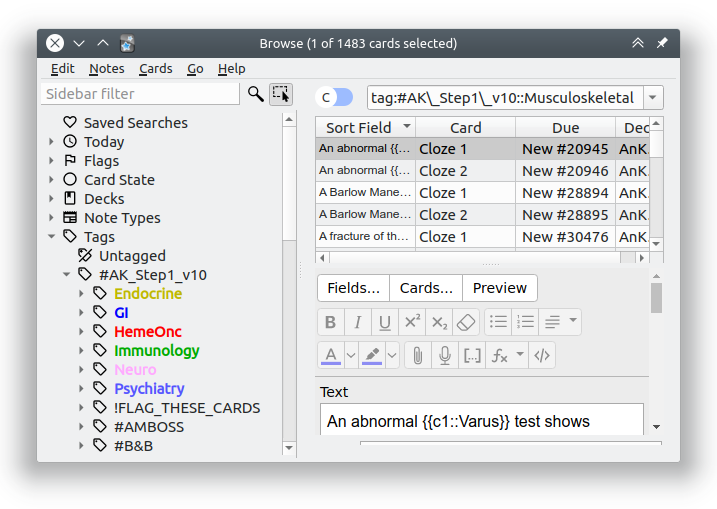

<h2 align="center">Colorful Tags Add-on for Anki</h2>

This repo hosts the bug tracker for [Colorful Tags](https://www.patreon.com/glutanimate/posts?tag=ColorfulTags), an [Anki add-on](https://apps.ankiweb.net) that is currently available through [my Patreon page](https://www.patreon.com/glutanimate) and that of [@AnKingMed's](https://www.patreon.com/ankingmed). Colorful Tags brings the tag coloring and pinning features from [BetterTags](https://www.patreon.com/posts/bettertags-v1-0-33338657) over to Anki 2.1.45, providing users with more tools to classify their tags.

Please feel free to use this repo to report any bugs you run into, or suggest new features for the add-on.

----

<b>

The continued development of this add-on is made possible  thanks to my <a href="https://www.patreon.com/glutanimate">Patreon</a> and <a href="https://ko-fi.com/X8X0L4YV">Ko-Fi</a> supporters.
 You guys rock ❤️ !

</b>